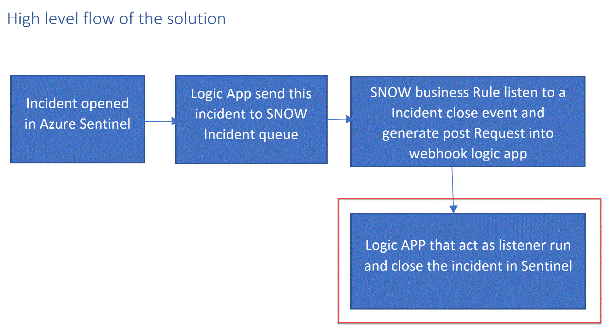

#  Close-SentinelIncident-From-Snow

Author: Yaniv Shasha

 This Logic App will act as listener for a incident close event in ServiceNow  and will close the incident in Sentinel.

 
## The above solution assembles from two parts:
1.	Business rule in ServiceNow side that trigger a custom JS code, on a   incident close event.
2.	Logic app on Azure Sentinel side that listen to the business rule POST request and close the Sentinel Event. 

 

 ### After Deploying the logicApp you will see the above workflow.

 

### The playbook, works as follow:
1.	Triger when http post request hit the endpoint (1)
2.	Get relevant properties from the ServiceNow Incident. 
3.	Close the incident on Azure Sentinel. (4)
4.	Add comment with the closed username into Azure sentinel comment (5) 

**Deploying the solution**:

This flow assume that customer use the above logic app [found here](https://github.com/Azure/Azure-Sentinel/tree/master/Playbooks/Open-SNOW-Ticket) to export the incident into ServiceNow.

The incident properties that we export from Azure sentinel into ServiceNow incident page should look like this:

1.	Deploy the above logic APP
2.	Copy the Http endpoint Url from the trigger part (we will need to use in the business rule JS code)
 
3.	On the “run query and list results” (2) authenticate with user that have log analytics read permission or Azure sentinel Reader as a minimum requirement.
4.	On the get incident – bring a fresh ETAG (3) authenticate with AAD APP with Azure sentinel Reader, or with Managed identity with the same minimum permission.
5.	On the close incident step (4) we will need to use Azure sentinel contributor as the identity for the close operation, again we can use AAD APP or managed identity.
6.	On the add comment to incident (5) we can use the Azure sentinel contributor account. 

