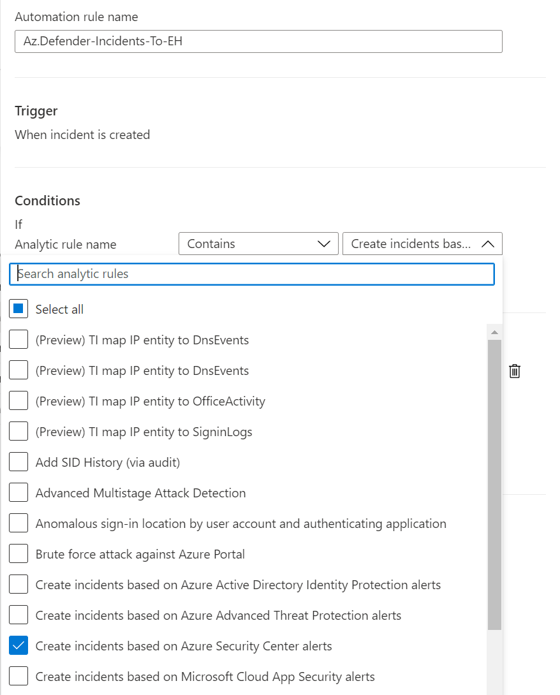

# Send-DefnderIncident2EH

This playbook will send Defender 365 and Azure defender incident into Event Hub,this playbook uses the new incident trigger and needs automation rule to trigger."

Author: Yaniv Shasha

Deploy the solution
1.	Create an Event Hub using the article "Create an event hub using Azure portal"  
https://docs.microsoft.com/en-us/azure/event-hubs/event-hubs-create  or use an existing Event Hub.
2.	Go to the Playbook GitHub page. 
3.	Press the “deploy to azure” button.
4.  Create 2 automation rules with the above conditions  

 
  
  

