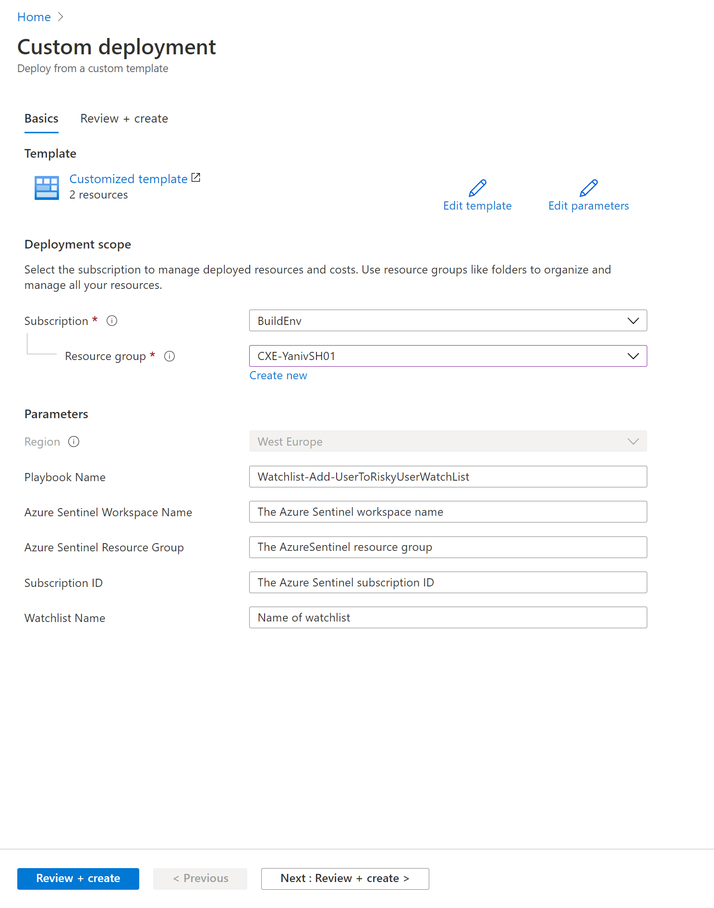

#  Watchlist-Add-UserToRiskyUserWatchList

Author: Yaniv Shasha

This playbook will add User entity to a new or exsisting watchlist.

 

## logical flow to use this playbook

	1. The analyst finished investigate an incident one of its finding is a suspicious user entity.
	2. The analyst wants to enter this entity  to a watchlist (can be from block list type or allowed list).
	3. This playbook can be run an manual trigger from the full incident blade or from the investigation graph blade.
	4. As part of the deployment you will be selected the watchlist name.
	5. If this watchlist exist the new user entity will append (update operation), if the watchlist is not exist the playbook will create it and add the new item to it.

 
  

**The playbook, available here and presented below, works as follows:**
1.	Manually trigger when we want to add user entity from a given alert
2.	Get the user entity relevant 
3.	Create an array of the user properties 
4.	Create a CSV from this array
5.  Check if the watchlist exist, if it exist use watchlist API an append the data, if not create a new watchlist and append the data. 

 ### After Deploying the logicApp you will see the above workflow.

 
  
  
**Deploying the solution**:

 

1. Add the missingproperties in the ARM template deployment 
   The Watchlist name will be also the alias name that you will use to query the data, for example 

      _GetWatchlist(**'RiskUsers'**)

