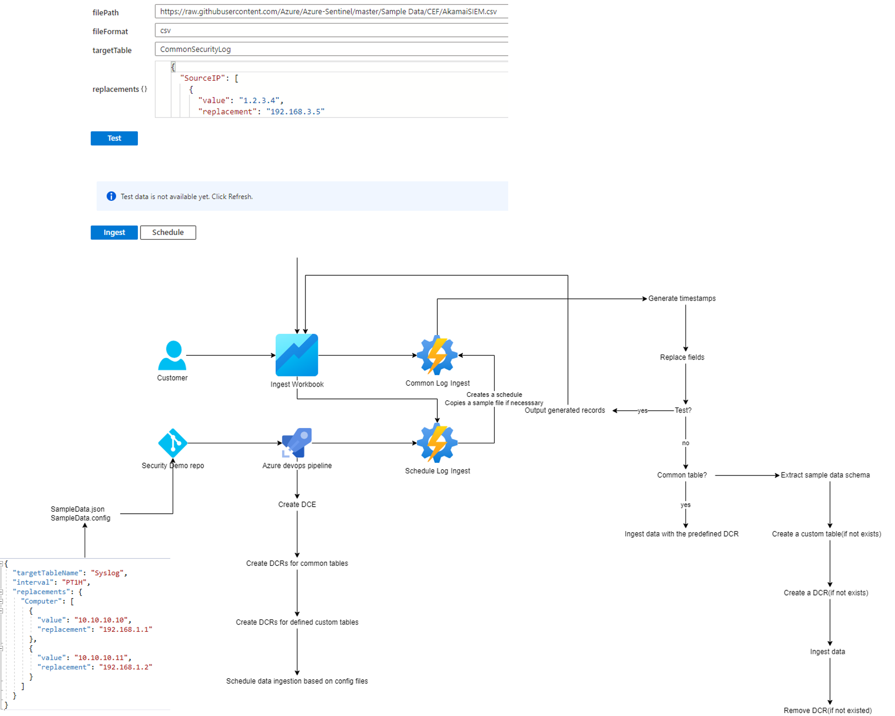
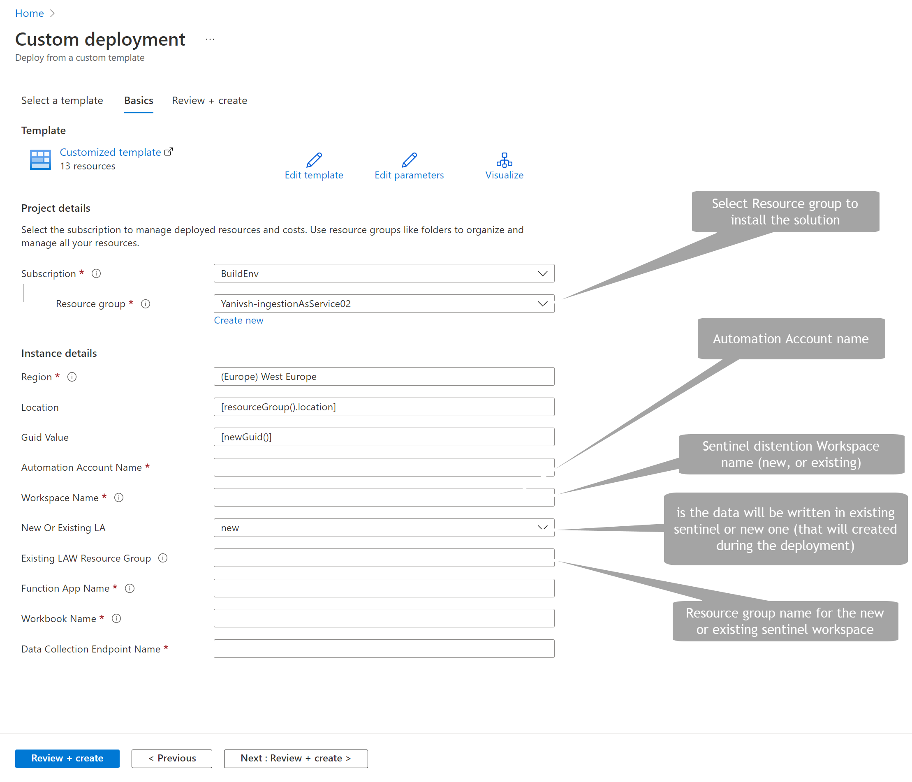

# Microsoft Sentinel Ingestion-AsA-Service

Microsoft Sentinel ingestion-as-a-service uses Azure monitor API to ingest data into Sentinel instances.
This new solution's main motivation is to provide a simple way to ingest data in a scheduled manner into a built-in table or a custom table.
Inputs for this solution include log files (JSON or CSV) hosted in GitHub public repositories or Storage accounts.
With this solution users can also carry out transformations on these logs before they are sent to the destination table.

We can use this solution to ingest data on demand into the above-mentioned tables:

- SecurityEvent
- Syslog
- WindowsEvent
- CommonSecurity
- ASimDnsActivityLogs
- Custom tables 

#### This tool can be used to address the following business use cases:

1. **Detection simulation** – Microsoft Sentinel is Search base SIEM, meaning that after the raw events ingested into the system, the detection engine uses KQL query logic on these logs and if we it has a match, incident and alert are created. with this new tool the detection engineers will be able to ingest security data and use transformation to control the entities and the fields that will expose in the detection and use it to check if the built-in detection or newly created detection works as expected.

2. **Demo Lab with live incidents and Workbooks** – Customers and partners both share the need for a live demo environment with continuously updated incidents and workbooks to demonstrate Sentinel functionally and train the SOC on investigation procedures and Sentinel features.
This tool can help us to ingest data that can trigger an incident in a schedule manner that will allow customers to build demo scripts on top of them.

3. **End2End testing for sentinel functionality** – In addition, SIEM engineers can build monitoring around different product features by ingesting expected data into the system as part of schedule management.
We ingested a security event called "1102 - The audit log was cleared" that will trigger a new incident every time we receive data. We can build monitoring around this flow to check:

* Log ingestion delays
* Analytic rule engine functionally
* Incident creation method
* Automation scenario (add automation role when incident and alert are created).

#### High-level diagram of the solution:

 - The solution uses Azure Workbook as the presentation layer. On this area users will be pointing the input file and define the transformation.
- Ingestion engine - we use Azure automation accounts, one for the ingestion itself, and the other for scheduling queues. 
- Schema management we use Azure function as parser helper that creates the “field to replace” list.
- Data collection Rules – as part of the solution deployment we create DCR’s (Data collection rules) for every built-in table and if user select to ingest custom log, we create the DCR on ingestion time and delete it after.

####Deploying the Solution

Once you click on the deploy to Azure button, the solution package will be deployed as an ARM template, a deploying screen will appear.

Add the missing properties and press create 

